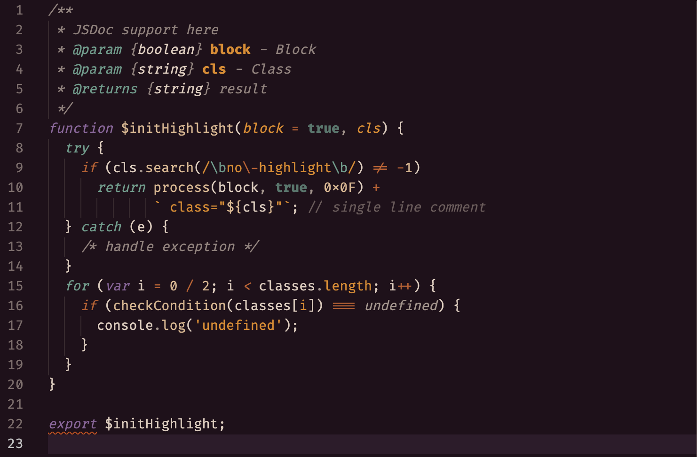
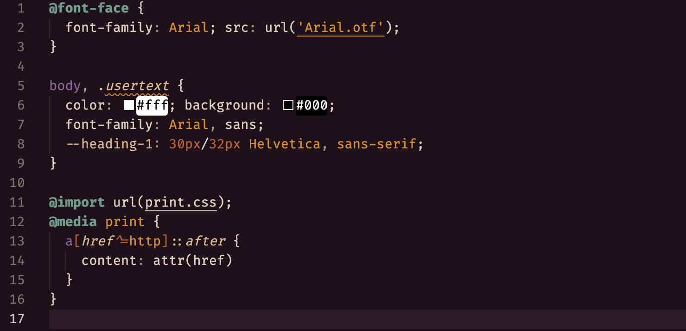

# Dead Club City

A Nothing But Thieves-inspired color theme for VSCode.

> This color theme was generated by [VSColor](https://kenzie.ink/vscolor/), a tool made by [Kenzie Bottoms](https://kenzie.ink/).

### Palette

- `#20101A`/`#E0CCBD`
- `#8E649C`
- `#C45D26`
- `#E48911`
- `#DEB58D`
- `#649D8B`

## Supported Languages

- Explicitly written for
    - CSS
      - SCSS
    - Java
    - JavaScript
      - React
    - Python
    - Vue
- Spot-checked for
    - Swift
    - Ruby
- User-approved for
    - Go

## Previews

- [Python](#python)
- [Javascript](#javascript)
  - [React](#react)
- [Ruby](#ruby)
- [CSS](#css)
  - [SCSS](#scss)
- [Java](#java)
- [Swift](#swift)

### Python

### Javascript

#### React

### Ruby

### CSS

#### SCSS

### Java

### Swift

---

> *Sample code stolen from https://highlightjs.org/*

> *Palette screenshot stolen from https://coolors.co*